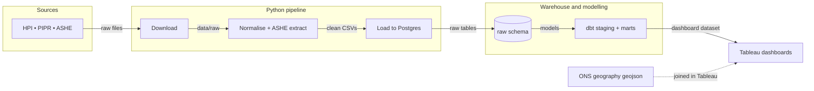

# london-housing-analytics


## Project overview

This project builds a London housing analytics pipeline from official public datasets into PostgreSQL and dbt marts for downstream Tableau reporting.

Current repo progress:

- Config-driven download for HM Land Registry HPI, ONS PIPR, and ONS ASHE (vintages live in `config/sources.yml`)
- London-only normalised outputs in `data/normalised`; ASHE zip is extracted on demand and resolved by pattern
- PostgreSQL raw-table loading via `src/load/load_to_postgres.py` (fails loudly on missing inputs)
- dbt staging and mart models for affordability, latest borough snapshot, and property-type analysis
- Staging and mart tests (uniqueness, not-null, accepted-values) plus source-freshness thresholds
- `Makefile` orchestrates the full pipeline (`make all`) and serves dbt docs on :8080
- GitHub Actions CI runs ruff and `dbt parse` on every push
- Tableau work has not started yet

## Why London

This project analyses housing affordability and rental pressure across London boroughs using official HM Land Registry and ONS datasets. It is intentionally scoped to London for deeper borough-level storytelling and clearer Tableau outputs, while keeping the pipeline architecture extensible to wider England and Wales coverage later.

## Business questions

- Which London boroughs are least affordable when comparing average house prices with resident earnings?
- Where is rental pressure rising faster than local income growth?
- How do borough-level sales volumes and price growth move together over time?
- Which boroughs show the biggest affordability gap by property type?
- How far does a typical 10% deposit sit from local annual earnings across boroughs?

## Architecture diagram



> The spatial geojson is consumed directly in Tableau for borough mapping; it is not loaded into dbt yet.

## Data sources

- HM Land Registry UK House Price Index average prices
- HM Land Registry UK House Price Index sales volumes
- HM Land Registry UK House Price Index property type prices
- ONS Price Index of Private Rents monthly price statistics
- ONS Annual Survey of Hours and Earnings place-of-residence tables (Table 8.7a, "Annual pay - Gross")
- ONS local authority district boundary geography for Tableau mapping (`data/spatial/lad_2024_bgc.geojson`)

Vintages (release month / reference year) are configured in [`config/sources.yml`](config/sources.yml). Update that file when a new release lands — URLs and filenames are templated from it, so no code change is needed.

Contains HM Land Registry data © Crown copyright and database right. Contains Office for National Statistics data licensed under the Open Government Licence v3.0 where applicable.

The HPI pages and ONS geography pages are published under OGL-style terms and attribution conventions.

## Data model

| Layer | Objects |
| --- | --- |
| Raw files | `data/raw/*` |
| Normalised files | `data/normalised/*` |
| PostgreSQL raw schema | `raw.hpi_average_prices`, `raw.hpi_property_type_prices`, `raw.hpi_sales`, `raw.pipr_local_rents`, `raw.ashe_earnings` |
| dbt staging | `stg_hpi_average_prices`, `stg_hpi_property_type_prices`, `stg_hpi_sales`, `stg_pipr_local_rents`, `stg_ashe_earnings` |
| dbt marts | `mart_london_affordability_monthly`, `mart_london_borough_snapshot_latest`, `mart_london_property_type_latest` |

## KPI definitions

| KPI | Definition |
| --- | --- |
| `average_price` | Average residential sale price from HPI |
| `avg_monthly_rent` | Average monthly private rent from PIPR |
| `sales_volume` | Monthly sales count from HPI |
| `median_gross_annual_pay` | Median gross annual pay from ASHE |
| `house_price_yoy_pct` | Year-on-year house price change |
| `rent_yoy_pct` | Year-on-year rent change |
| `earnings_yoy_pct` | Year-on-year earnings change derived in dbt |
| `price_to_earnings_ratio` | `average_price / median_gross_annual_pay` |
| `annual_rent_to_earnings_ratio` | `(avg_monthly_rent * 12) / median_gross_annual_pay` |
| `months_to_save_10pct_deposit` | `(average_price * 0.10) / (median_gross_annual_pay / 12)` |
| `rent_growth_minus_income_growth_pct` | `rent_yoy_pct - earnings_yoy_pct` |
| `house_price_growth_minus_income_growth_pct` | `house_price_yoy_pct - earnings_yoy_pct` |
| `earnings_fallback_used` | `true` when the London regional earnings fallback is used |

## Tableau dashboard screenshots

## Tableau Public link

## How to run locally

Requires Python 3.12, Docker, and dbt-postgres 1.8.

1. Create the environment and install dependencies.

```bash
python3.12 -m venv .venv
source .venv/bin/activate
make install
```

2. Copy `.env.example` to `.env` and start PostgreSQL. Docker Compose reads the credentials from `.env`.

```bash
cp .env.example .env
make up
```

3. Create `~/.dbt/profiles.yml`.

```yaml
housing_warehouse:
  target: dev
  outputs:
    dev:
      type: postgres
      host: localhost
      port: 5432
      user: analytics
      password: analytics
      dbname: housing_warehouse
      schema: analytics
      threads: 4
```

4. Run the pipeline end to end.

```bash
make all          # download + normalise + load + dbt deps + dbt run + dbt test + export
```

Or run individual steps: `make download`, `make normalise`, `make load`, `make dbt-run`, `make dbt-test`, `make dbt-docs` (serves the lineage graph on http://localhost:8080), `make export`.

`src/transform/inspect_sources.py` is an optional utility used during development to preview sheet structure; it is not required for the pipeline.

## Limitations

- UK HPI local-level estimates below regional level use a 3-month moving average, so borough results are best interpreted as trend signals rather than as ultra-precise single-month spot estimates.
- HPI sales volumes exclude the most recent two months because the data are not complete enough for reliable reporting.
- City of London can be volatile because low transaction counts can distort local monthly changes.
- PIPR is an official statistic in development, and the latest two months are subject to revision.

## Future improvements

- Publish the first Tableau workbook, screenshots, and Tableau Public link.
- Bring the spatial boundary file into the reporting layer (currently consumed directly in Tableau).
- Add cross-source reconciliation tests (e.g. borough coverage parity between HPI and PIPR).
- Extend the pipeline beyond London once the borough-level story and dashboard design are stable.
