# london-housing-analytics

## Project overview

This project builds a London housing analytics pipeline from official public datasets into a PostgreSQL warehouse and dbt marts for downstream Tableau reporting.

Current progress reflected in this repo:

- Raw source download automation is in place for HM Land Registry HPI, ONS PIPR, and ONS ASHE data.
- Source inspection and ASHE workbook extraction are implemented in `src/transform/inspect_sources.py`.
- London-only normalised CSV outputs are generated in `data/normalised`.
- Normalised datasets can be loaded into PostgreSQL `raw` tables with `src/load/load_to_postgres.py`.
- dbt staging and mart models are implemented for affordability, borough snapshot, and property type analysis.
- Local dbt artifacts in `dbt/target` show 8 models and 7 passing tests from the latest run.
- Tableau delivery has not started yet, so the README sections for screenshots and Tableau Public are intentionally left empty.

## Why London

This project analyses housing affordability and rental pressure across London boroughs using official HM Land Registry and ONS datasets. It is intentionally scoped to London for deeper borough-level storytelling and clearer Tableau outputs, while keeping the pipeline architecture extensible to wider England and Wales coverage later.

## Business questions

- Which London boroughs are least affordable when comparing average house prices with resident earnings?
- Where is rental pressure rising faster than local income growth?
- How do borough-level sales volumes and price growth move together over time?
- Which boroughs show the biggest affordability gap by property type?
- How far does a typical 10% deposit sit from local annual earnings across boroughs?

## Architecture diagram

```mermaid
flowchart LR
    A[HM Land Registry HPI<br/>ONS PIPR<br/>ONS ASHE<br/>ONS geography] --> B[src/extract/download_sources.py]
    B --> C[data/raw]
    C --> D[src/transform/inspect_sources.py]
    C --> E[src/transform/normalise_sources.py]
    D --> C1[data/raw/ashe_extracted]
    C1 --> E
    E --> F[data/normalised CSVs]
    F --> G[src/load/load_to_postgres.py]
    G --> H[Postgres raw schema]
    H --> I[dbt staging models]
    I --> J[dbt marts in analytics schema]
    J --> K[Tableau dashboards]
```



## Data sources

- HM Land Registry UK House Price Index average prices, stored in `data/raw/hpi_average_prices_2026_01.csv`
- HM Land Registry UK House Price Index sales volumes, stored in `data/raw/hpi_sales_2026_01.csv`
- HM Land Registry UK House Price Index property type prices, stored in `data/raw/hpi_property_type_prices_2026_01.csv`
- ONS Price Index of Private Rents monthly price statistics, stored in `data/raw/pipr_monthly_price_statistics_2026_03.xlsx`
- ONS Annual Survey of Hours and Earnings place-of-residence tables, stored in `data/raw/ashe_table8_2025_provisional.zip` and extracted into `data/raw/ashe_extracted`
- ONS local authority district boundary geography for mapping support, stored in `data/spatial/lad_2024_bgc.geojson`

Contains HM Land Registry data (C) Crown copyright and database right. Contains Office for National Statistics data licensed under the Open Government Licence v3.0 where applicable.

The HPI pages and ONS geography pages are published under OGL-style terms and attribution conventions.

## Data model

| Layer | Objects | Purpose |
| --- | --- | --- |
| Raw files | `data/raw/*` | Downloaded source files exactly as received from HM Land Registry and ONS |
| Normalised files | `data/normalised/*` | London-filtered, cleaned flat files ready for database loading |
| PostgreSQL raw schema | `raw.hpi_average_prices`, `raw.hpi_property_type_prices`, `raw.hpi_sales`, `raw.pipr_local_rents`, `raw.ashe_earnings` | Landing tables loaded from the normalised CSV outputs |
| dbt staging | `stg_hpi_average_prices`, `stg_hpi_property_type_prices`, `stg_hpi_sales`, `stg_pipr_local_rents`, `stg_ashe_earnings` | Typed and renamed analytical views over the raw schema |
| dbt marts | `mart_london_affordability_monthly`, `mart_london_borough_snapshot_latest`, `mart_london_property_type_latest` | Final analytical datasets for Tableau and borough-level storytelling |

## KPI definitions

- `average_price`: Average residential sale price from HM Land Registry HPI.
- `avg_monthly_rent`: Average monthly private rent from ONS PIPR.
- `sales_volume`: Monthly sales count from HM Land Registry HPI.
- `median_gross_annual_pay`: Median gross annual pay from ONS ASHE.
- `house_price_yoy_pct`: Year-on-year house price change percentage from HPI.
- `rent_yoy_pct`: Year-on-year rent change percentage from PIPR.
- `earnings_yoy_pct`: Year-on-year earnings change percentage derived in dbt from ASHE.
- `price_to_earnings_ratio`: `average_price / median_gross_annual_pay`
- `annual_rent_to_earnings_ratio`: `(avg_monthly_rent * 12) / median_gross_annual_pay`
- `months_to_save_10pct_deposit`: `(average_price * 0.10) / (median_gross_annual_pay / 12)`
- `rent_growth_minus_income_growth_pct`: `rent_yoy_pct - earnings_yoy_pct`
- `house_price_growth_minus_income_growth_pct`: `house_price_yoy_pct - earnings_yoy_pct`
- `earnings_fallback_used`: Boolean flag showing whether the London regional earnings figure was used instead of a borough-specific value in the affordability mart.

## Tableau dashboard screenshots

## Tableau Public link

## How to run locally

1. Create and activate a Python virtual environment, then install dependencies.

```bash
python3.12 -m venv .venv
source .venv/bin/activate
pip install -r requirements.txt
```

2. Copy `.env.example` to `.env`.

```bash
cp .env.example .env
```

3. Start PostgreSQL with Docker Compose.

```bash
docker compose up -d
```

4. Create `~/.dbt/profiles.yml` so dbt can connect to the local warehouse.

```yaml
housing_warehouse:
  target: dev
  outputs:
    dev:
      type: postgres
      host: localhost
      port: 5432
      user: analytics
      password: analytics
      dbname: housing_warehouse
      schema: analytics
      threads: 4
```

5. Download the source files.

```bash
python src/extract/download_sources.py
```

6. Inspect the sources and extract the ASHE workbook contents from the ZIP file.

```bash
python src/transform/inspect_sources.py
```

7. Build the normalised London-only CSV outputs.

```bash
python src/transform/normalise_sources.py
```

8. Load the normalised outputs into PostgreSQL.

```bash
python src/load/load_to_postgres.py
```

9. Run dbt models and tests.

```bash
cd dbt
dbt run
dbt test
```

## Limitations

- UK HPI local-level estimates below regional level use a 3-month moving average, so borough results are best interpreted as trend signals rather than as ultra-precise single-month spot estimates.
- HPI sales volumes exclude the most recent two months because the data are not complete enough for reliable reporting.
- City of London can be volatile because low transaction counts can distort local monthly changes.
- PIPR is an official statistic in development, and the latest two months are subject to revision.

## Future improvements

- Publish the first Tableau workbook, screenshots, and Tableau Public link.
- Parameterise source vintages so month-stamped file names and URLs do not need manual code updates.
- Add stronger dbt tests for freshness, uniqueness, accepted values, and cross-source reconciliation.
- Bring the spatial boundary file into the reporting layer for borough-level mapping.
- Extend the pipeline beyond London once the borough-level story and dashboard design are stable.
