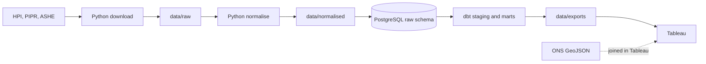

# London Housing Affordability Analytics


This project builds a local analytics pipeline for London housing affordability and rental pressure. It downloads official public datasets, normalises them to London borough level, loads them into PostgreSQL, builds dbt marts, and exports Tableau-ready CSVs.

## What It Answers

- Which London boroughs are least affordable relative to resident earnings?
- Where are rents rising faster than local income?
- How do sales volumes and house price growth move together over time?
- Which property types have the largest affordability gaps by borough?
- How many months of gross earnings would a 10% deposit represent?

## Pipeline


```mermaid
flowchart LR
    SRC[HPI, PIPR, ASHE] --> DL[Python download]
    DL --> RAW[data/raw]
    RAW --> NORM[Python normalise]
    NORM --> CSV[data/normalised]
    CSV --> PG[(PostgreSQL raw schema)]
    PG --> DBT[dbt staging and marts]
    DBT --> EXP[data/exports]
    EXP --> TAB[Tableau]
    GEO[ONS GeoJSON] -. joined in Tableau .-> TAB
```

Spatial files are kept in `data/spatial` and joined directly in Tableau; they are not loaded into dbt yet.

## Data Sources

Release vintages and download URLs live in [`config/sources.yml`](config/sources.yml).

| Source | Used for |
| --- | --- |
| HM Land Registry UK House Price Index | Average prices, sales volumes, property-type prices |
| ONS Price Index of Private Rents | Monthly borough rent estimates |
| ONS Annual Survey of Hours and Earnings, Table 8.7a | Median gross annual pay by residence |
| ONS LAD boundary geography | Tableau borough mapping |

Contains HM Land Registry data Crown copyright and database right. Contains Office for National Statistics data licensed under the Open Government Licence v3.0 where applicable.

## Data Model

| Layer | Objects |
| --- | --- |
| Raw files | `data/raw/*` |
| Normalised files | `data/normalised/*` |
| PostgreSQL raw schema | `raw.hpi_average_prices`, `raw.hpi_property_type_prices`, `raw.hpi_sales`, `raw.pipr_local_rents`, `raw.ashe_earnings` |
| dbt staging | `stg_hpi_average_prices`, `stg_hpi_property_type_prices`, `stg_hpi_sales`, `stg_pipr_local_rents`, `stg_ashe_earnings` |
| dbt marts | `mart_london_affordability_monthly`, `mart_london_borough_snapshot_latest`, `mart_london_property_type_latest` |

## Key Metrics

| Metric | Definition |
| --- | --- |
| `price_to_earnings_ratio` | `average_price / median_gross_annual_pay` |
| `annual_rent_to_earnings_ratio` | `(avg_monthly_rent * 12) / median_gross_annual_pay` |
| `months_to_save_10pct_deposit` | `(average_price * 0.10) / (median_gross_annual_pay / 12)` |
| `rent_growth_minus_income_growth_pct` | `rent_yoy_pct - earnings_yoy_pct` |
| `house_price_growth_minus_income_growth_pct` | `house_price_yoy_pct - earnings_yoy_pct` |
| `earnings_fallback_used` | `true` when the London regional earnings value is used |

## Run Locally

Requirements:

- Python 3.12
- Docker with Docker Compose
- GNU Make

Create a virtual environment and install dependencies:

```bash
python3.12 -m venv .venv
source .venv/bin/activate
make install
```

PowerShell equivalent:

```powershell
py -3.12 -m venv .venv
.\.venv\Scripts\Activate.ps1
python -m pip install -r requirements.txt
```

Copy the environment template and start PostgreSQL:

```bash
cp .env.example .env
make up
```

PowerShell equivalent:

```powershell
Copy-Item .env.example .env
docker compose up -d --wait
```

Create `~/.dbt/profiles.yml`:

```yaml
housing_warehouse:
  target: dev
  outputs:
    dev:
      type: postgres
      host: localhost
      port: 5432
      user: analytics
      password: analytics
      dbname: housing_warehouse
      schema: analytics
      threads: 4
```

Run the full pipeline:

```bash
make all
```

This runs unit tests, downloads sources, normalises CSVs, loads PostgreSQL, installs dbt packages, builds and tests dbt models, and exports mart CSVs to `data/exports`.

Useful individual commands:

| Command | Purpose |
| --- | --- |
| `make test` | Run Python unit tests |
| `make download` | Download raw source files |
| `make normalise` | Build London-only normalised CSVs |
| `make load` | Replace raw PostgreSQL tables |
| `make dbt-run` | Build staging and mart models |
| `make dbt-test` | Run dbt data tests |
| `make dbt-docs` | Serve dbt docs at `http://localhost:8080` |
| `make export` | Export marts to CSV |

## Repository Layout

| Path | Purpose |
| --- | --- |
| `src/extract` | Source downloads |
| `src/transform` | Source normalisation and ASHE extraction |
| `src/load` | PostgreSQL load and mart exports |
| `src/common` | Shared config and database helpers |
| `dbt/models/staging` | Typed source views |
| `dbt/models/marts` | Tableau-facing analytics tables |
| `tests` | Lightweight Python unit tests |
| `tableau` | Placeholder for workbook assets |

## Current Status

- GitHub Actions runs ruff, Python unit tests, and `dbt parse`.
- Tableau-ready CSVs are exported, but the Tableau workbook is not committed yet.
- The pipeline is London-focused; the config-driven structure can be extended later.

## Limitations

- Borough-level HPI estimates use a three-month moving average and should be read as trend indicators.
- HPI sales volumes omit the most recent two months.
- City of London values can be volatile because transaction counts are low.
- PIPR is an official statistic in development, and recent months can be revised.
- Only the configured ASHE vintage is loaded, so historic affordability uses the available earnings vintage rather than a full earnings time series.
